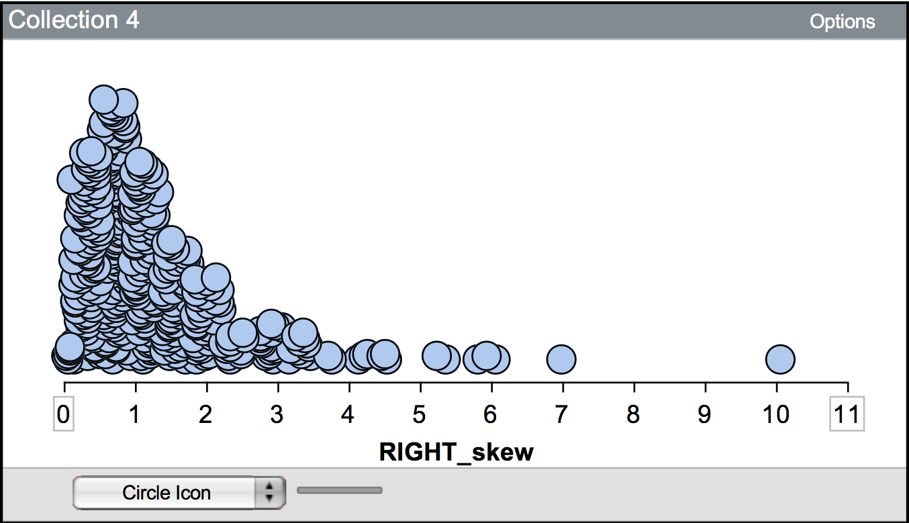
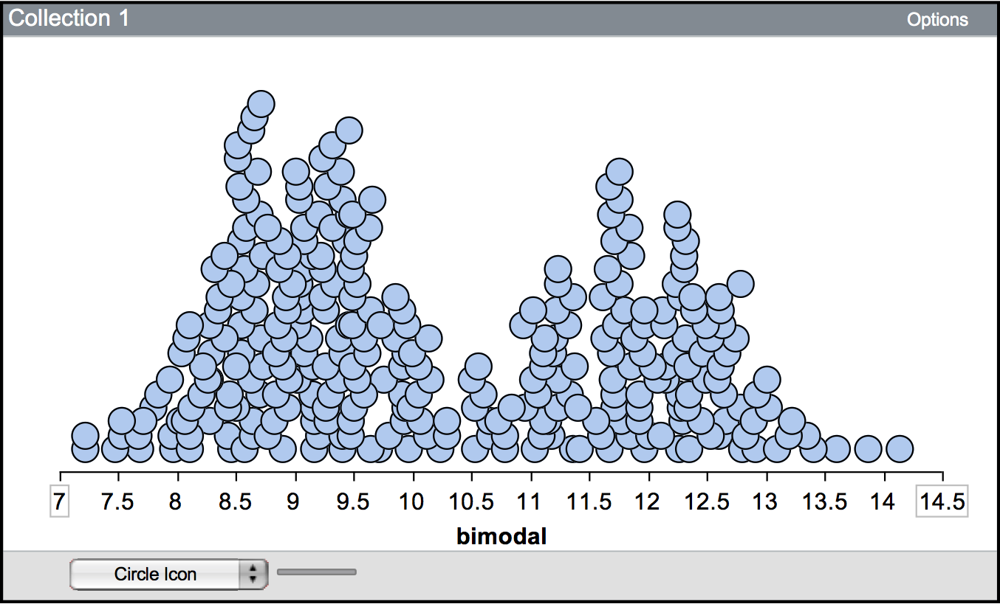

# Describiendo Distribuciones {-}

Un paso importante en cualquier análisis estadístico es el de resumir los datos. Es una buena práctica examinar tanto un resumen gráfico como uno numérico de los datos. Estos resúmenes suelen formar parte de las pruebas que las personas investigadoras utilizan para respaldar las conclusiones extraídas de los datos. También permiten a las personas investigadores descubrir estructuras que, de otro modo, podrían haberse pasado por alto en los datos brutos recopilados. Por último, los resúmenes gráficos y numéricos de los datos a menudo apuntan a otros análisis que pueden realizarse con los datos.

Una vez recogidos los datos brutos en un estudio, puede resultar abrumador extraer de ellos cualquier tipo de significado. Por ejemplo, no es raro que Google maneje millones de casos. ¿Cómo puede Google, o cualquier persona investigadora, pasar de todos esos datos brutos a algo que le ayude a responder a sus preguntas de investigación?

En lugar de examinar todos esos casos individualmente, las personas investigadores examinan los datos de forma colectiva, a menudo representándolos gráficamente. Esto es lo que se entiende por resumen gráfico de los datos; es, literalmente, una imagen de la distribución.

Se han creado muchísimos tipos de gráficos para resumir los datos. Cada uno de ellos puede proporcionar una representación ligeramente diferente de los datos. Metafóricamente, se puede imaginar cada uno de estos diferentes tipos de gráficos como una foto diferente tomada a la misma persona. Algunas pueden ser en color, otras en blanco y negro. Algunas pueden tomarse desde perspectivas, ángulos o distancias diferentes. Aunque todas las fotografías "resumen" a la misma persona, es posible que observe características de esa persona en algunas fotos que no son evidentes en otras. Sin embargo, muchas de las fotos mostrarán lo mismo. 

### Forma {-}

El gráfico de puntos que proporciona TinkerPlots&trade; es un gráfico muy útil. ^[TinkerPlots&trade; también proporciona otros tipos de gráficos, como el gráfico de caja (a veces llamado gráfico de caja y bigotes) y el gráfico de sombrero (una variación del gráfico de caja)]. Nos permite resumir la forma de la distribución muy fácilmente. La forma se utiliza para describir la simetría de una distribución. Como es de esperar, las distribuciones simétricas tienen la misma forma a ambos lados del centro. (Otra forma de pensar en esto es que si doblara la distribución por el centro, la mitad doblada de la distribución se alinearía bastante bien sobre la otra mitad). Por ejemplo, las distribuciones "en forma de campana" ("aproximadamente normales") son simétricas.

Cuando una distribución es asimétrica, se denomina **distribución sesgada**. La distribución de la Figura 1 es una distribución asimétrica. En esta distribución, parece haber una cola más larga en el lado derecho de la distribución. Como la cola está en el lado derecho de la distribución, los estadísticos dirían que está "sesgada a la derecha" o "sesgada positivamente". Del mismo modo, una distribución que tiene la cola a la izquierda está "sesgada a la izquierda" o "sesgada negativamente".

<br />

```{r out.width="50%", echo=FALSE, fig.align='center', fig.cap='This distribution is skewed to the right, or positively skewed.'}

```

<br />


### Posición {-}

Aparte de la forma general de la distribución, también es útil resumir la posición de la distribución. La posición de la distribución proporciona un resumen del denominado valor "típico" de los datos. Un valor "típico" puede obtenerse a partir del gráfico de la distribución. También se pueden utilizar resúmenes de la posición calculados de manera más formal, como la media, la mediana o la moda. Estos valores se calculan fácilmente utilizando TinkerPlots&trade;.

Al observar un gráfico de una distribución, los analistas de datos a menudo consideran el número de modas o "motañas" que se ven en un gráfico de la distribución. Aquí, el concepto de moda es ligeramente diferente (aunque relacionado) al concepto de moda que usted puede haber aprendido en cursos previos de matemáticas o estadística. La moda de una distribución da una idea general de los valores o medidas que ocurren con frecuencia. Puede ser un único número, pero muchas veces no lo es. Por ejemplo, la primera montaña de la distribución mostrada en la figura siguiente sugiere que los valores en torno a nueve son muy comunes. Sin embargo, es posible que el valor real de nueve sólo aparezca una o dos veces en los datos.

<br />

```{r out.width="50%", echo=FALSE, fig.align='center', fig.cap='A bimodal distribution showing two modes. One mode is around 9, and the other is near 12.'}

```

<br />

Una distribución puede ser **unimodal** (una moda), **bimodal** (dos modas), **multimodal** (muchas modas) o **uniforme** (sin modas). La distribución mostrada arriba es bimodal&mdash;observa que hay dos montañas. Las distribuciones uniformes tienen aproximadamente la misma frecuencia para todos los valores posibles (parecen esencialmente planas) y, por tanto, no tienen modas.

### Variación {-}

Una tercera característica de una distribución que debe resumirse es la variación o variabilidad. Resumir la variación da una indicación de lo variables que son los datos. Un método para resumir numéricamente la variabilidad de los datos consiste en cuantificar la proximidad de las observaciones con respecto al valor "típico" medio. ¿Están las observaciones en su mayoría cerca del valor "típico"? ¿Están lejos del valor "típico"? ¿Qué tan cerca?

Resulta que la forma de la distribución también ayuda a describir la variación de los datos. Por ejemplo, las distribuciones "en forma de campana" tienen la mayoría de las observaciones cerca del valor "típico", y las observaciones más extremas aparecen tanto por debajo como por encima del valor "típico" (la variación es la misma a ambos lados del valor "típico"). Mientras que las distribuciones sesgadas tienen muchas observaciones cerca del valor "típico", pero los valores extremos sólo se desvían de este valor en una dirección (hay más variación en los datos a un lado del valor "típico" que al otro).


<br />

```{r out.width="50%", echo=FALSE, fig.align='center', fig.cap='Most of the observations in this distribution are clustered between 0 and 2. There are some observations greater than 2 (up to 10), although these are rare.'}

```

<br />

Una cosa que afecta la variación, y que debe describirse, es si hay observaciones que sobresalen de las demás observaciones. A menudo, estas observaciones tienen valores extremadamente grandes o pequeños en relación con las demás observaciones. Estas observaciones se denominan **posibles valores atípicos**, o **casos extremos**. Por ejemplo, en la distribución sesgada positivamente mostrada anteriormente, la observación que tiene un valor cercano a 10 probablemente se consideraría un valor atípico potencial.

### Uniéndolo todo {-}

[Rotten Tomatoes](https://www.rottentomatoes.com/) es un sitio web que recopila críticas de películas. El sitio web califica cada crítica como positiva o negativa y luego da a la película una puntuación basada en el porcentaje de críticas positivas. Además de la puntuación de los críticos, cada película también recibe una puntuación basada en las críticas del público general utilizando la misma metodología (las críticas se tabulan de forma que la puntuación represente el porcentaje de críticas positivas del público general). El gráfico siguiente muestra la distribución de las puntuaciones del público en general para 134 películas estrenadas en 2009.

<br />

```{r out.width="50%", echo=FALSE, fig.align='center', fig.cap='The scores for 134 movies released in 2009 based on the general public’s reviews. The scores represent the percentage of positive reviews for each movie.'}
knitr::include_graphics("img/rotton-tomatoes.png")
```

<br />

Una descripción escrita de la distribución podría ser la siguiente:

> La distribución de las puntuaciones de esta muestra de 134 películas es bastante simétrica. La puntuación media de estas películas se aproxima a 60, lo que indica que una película típica estrenada en 2009 recibe críticas positivas de aproximadamente el 60% del público. La distribución también indica que hay variación en las puntuaciones de las películas. La mayoría de las películas de la muestra tienen una puntuación entre 35 y 85, lo que sugiere grandes diferencias en la opinión del público sobre la calidad de estas películas.

Observe que la descripción incluye una descripción de la forma, la ubicación y la variación de la distribución. También incorpora el contexto de los datos, en este caso las puntuaciones de las películas. Esto ayuda al lector a interpretar la descripción.
