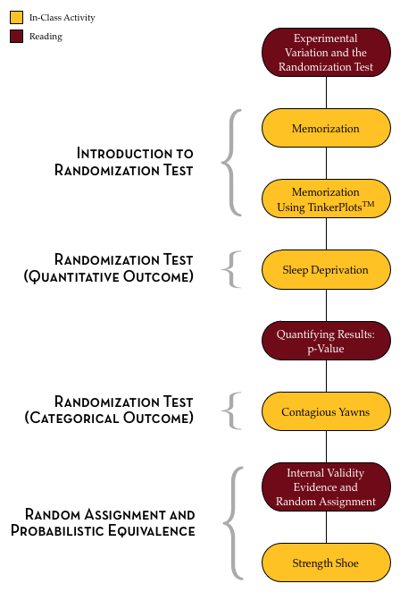

# Variación Experimental y la Prueba de Aleatoriedad {-}

> La naturaleza de hacer ciencia, ya sea natural o social, exige inevitablemente la comparación. Los métodos estadísticos están en el centro de esta comparación, ya que no sólo nos ayudan a comprender el mundo que nos rodea, sino que a menudo definen cómo debe llevarse a cabo nuestra investigación.^[Liao, T. F. (2002). *Statistical group comparison.* New York: Wiley.]

Hacer inferencia sobre las diferencias entre grupos es algo casi cotidiano en la vida de la mayoría de las personas. En cualquier hora de un día cualquiera, la televisión, la radio y las redes sociales abundan en comparaciones. Por ejemplo, los científicos de datos de OKCupid, un sitio de citas en línea, examinaron si las personas que realizan muchas publicaciones en Twitter tienen relaciones más cortas en la vida real que los demás.^[The website [OKTrends](http://blog.okcupid.com/) incluye una respuesta a esta pregunta, así como a muchas otras.]

Las comparaciones entre grupos son el núcleo de muchas cuestiones interesantes que se plantean personas en psicología, medicina, educación e ingeniería. Las cuestiones sobre las diferencias entre grupos suelen estudiarse mediante experimentos científicos. Cuando se plantea un experimento científico para examinar las diferencias entre grupos, el diseño del estudio desempeña un papel muy importante. Para entenderlo mejor, pensemos en una persona investigadora que estudia la eficacia de un nuevo medicamento para el resfriado. Supongamos que la esta persona cuenta con 100 personas (cada una con un resfriado) que se ofrecen voluntarias para participar en su estudio. Pensemos en cómo podría diseñar su estudio.

- **Diseño 1:** Suministrar el medicamento contra el resfriado a los 100 persona voluntaria.
- **Diseño 2:** Suministrar el medicamento contra el resfriado a las primeras 50 personas voluntarias (grupo de tratamiento) y nada a las otras 50 personas voluntarias (grupo de control).
- **Diseño 3:** Elige al azar a 50 de las personas voluntarias a los que da el medicamento para el resfriado (grupo de tratamiento) y no se les da nada a las otras 50 personas voluntarias (grupo de control).

Los tres diseños se han utilizado, y se siguen utilizando, en estudios de investigación. Cada uno de los diseños tiene sus pros y sus contras, y todos son útiles en función de lo que se quiera saber. 

En el Diseño 1, es difícil juzgar la eficacia de la medicación. Por ejemplo, ¿qué pasaría si 60 de las personas voluntarias no tuvieran síntomas de resfriado al cabo de cuatro días? ¿Funcionó la medicación? Quizá piense: "¿qué habría pasado si no hubieran recibido ninguna medicación?". Es una gran pregunta. En este diseño, no lo sabemos.

El diseño 2 ofrece a la persona investigadora un grupo de comparación. Puede comparar el número de personas voluntarias de cada grupo que no tienen síntomas de resfriado después de cuatro días. Este es un diseño mejor que el Diseño 1 para examinar la eficacia. Pero, ¿qué pasaría si descubriera que después de cuatro días, 35 de las personas voluntarias que recibieron la medicación no tenían síntomas, mientras que sólo 25 de las personas voluntarias que no recibieron medicación no tenían síntomas? ¿Son suficientes pruebas para afirmar que la medicación contra el resfriado es eficaz? Probablemente no. Quizá la mayoría de las personas voluntarias del grupo de tratamiento ya estaban en fases avanzadas de su resfriado. Tal vez tenían un sistema inmunitario más robusto que el del grupo de control (por ejemplo, debido a unos hábitos de ejercicio o nutrición diferentes). Se pueden imaginar muchas razones por las que el grupo de tratamiento mostraría una mejoría más rápida que el grupo de control.

El Diseño 3 tiene la misma ventaja del grupo de comparación que el Diseño 2. La gran diferencia, sin embargo, es que las personas voluntarias fueron asignados a los grupos al azar. Al asignar los participantes al azar, la persona que investiga "iguala" los grupos de tratamiento y de control. Esto significa que los grupos tienen, en promedio, los MISMOS hábitos nutricionales, los MISMOS hábitos de ejercicio y lo MISMO en todo lo demás. Esto significa que lo único que difiere entre los dos grupos es que el grupo de tratamiento recibió la medicación para el resfriado y el grupo de control no. Si la persona investigadora utiliza este tipo de diseño, puede sacar conclusiones mucho más sólidas sobre el PORQUÉ mejoró el grupo de tratamiento: ¡fue gracias a la medicación para el resfriado!

### Variación Experimental {-}

Supongamos que nuestra hipotética persona investigadora utilizó un diseño fuerte en el que asignó aleatoriamente a sus personas voluntarias a los grupos de tratamiento y control. Después de cuatro días, descubrió que 35 de las 50 personas voluntarias del grupo de tratamiento no presentaban síntomas y que 27 de las 50 del grupo de control no presentaban síntomas. ¿Podría concluir que la medicación para el resfriado es eficaz porque 8 voluntarios más del grupo de tratamiento no tenían síntomas? 

En realidad, no. Y la razón es la variación experimental. Consideremos la situación en la que el tratamiento no tiene absolutamente NINGÚN EFECTO. En otras palabras, no hace nada. En ese supuesto, los grupos de tratamiento y de control deberían mejorar aproximadamente al mismo ritmo. En el supuesto de que el tratamiento no tenga ningún efecto, las diferencias entre el grupo de tratamiento y el de control no dependen del medicamento para el resfriado. Se deben únicamente al azar. De forma similar a los estudios que vimos en la Unidad 2, tenemos que averiguar cuánta variación aleatoria se espera antes de poder decir si la diferencia de 8 personas voluntarias es realmente una mejora. 

Una diferencia clave entre este tipo de estudio y los de la Unidad 2 es que la variación aleatoria surge de la asignación a grupos en estos estudios, mientras que en la Unidad 2, la variación aleatoria surgió debido al muestreo de una población mayor. Cuando la variación por azar se debe a la asignación de los participantes a los grupos, se denomina *variación experimental* en lugar de *variación por muestreo*. 

### Esquema y objetivos de la Unidad 3 {-}

El siguiente esquema describe las lecturas del curso, las actividades en clase y las tareas de la Unidad 3.

<br />

```{r out.width="65%", echo=FALSE, fig.align='left'}

```

<br />

En las lecturas, actividades del curso y asignaciones de la Unidad 3, explorará el proceso de modelar la variación experimental para poder evaluar las diferencias observadas entre grupos. Usted aprenderá acerca de la prueba de aleatorización (un método de Monte Carlo para evaluar si un resultado observado en compatible con la variación experimental de un modelo hipotetizado) y cómo llevar a cabo esta prueba utilizando TinkerPlots&trade;.
