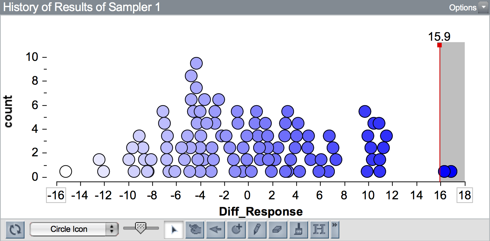

# Cuantificando Resultados: p-Value {-}

Además de calcular la gama de resultados probables del modelo, las personas profesionales en estadística también suelen proporcionar una cuantificación de la probabilidad del resultado observado dado el modelo hipotético. Esta cuantificación se denomina valor $p$ ($p$ significa probabilidad). 

Para calcular un valor $p$, se cuenta el número de resultados que son al menos tan extremos como el resultado observado y se divide por el número total de resultados. 

$$
p = \frac{\mathrm{cantidad~de~resultados~al~menos~tan~extremos~como~el~observado}}{\mathrm{catidad~total~de~resultado~simulados}}
$$

Este valor se presenta como un valor decimal. El valor $p$ Cuantifica la probabilidad de observar un resultado al menos tan extremo como el resultado observado según el modelo hipotético.

Para ilustrarlo este concepto, volveremos a examinar los resultados de la simulación del estudio *Privación del sueño*. Recordemos que en esa actividad, los datos observados tenían una diferencia de medias de 15,9. A continuación se muestra un gráfico de 100 diferencias de medias simuladas con el modelo "sin efecto". Se muestra una línea vertical en la diferencia observada de 15,9.

```{r out.width="70%", echo=FALSE, fig.align='center'}

```

Como 15,9 está a la derecha de 0 (es decir, está en el lado derecho del gráfico), los resultados *más extremos que el resultado observado* están a la derecha de 15,9. (Si el resultado observado estuviera a la izquierda de 0, los resultados más extremos serían los más negativos que el resultado observado). (Si el resultado observado estuviera a la izquierda de 0, los resultados más extremos serían los más negativos que el resultado observado). Aquí hay dos resultados simulados de 100 que son al menos tan extremos como 15,9 ($\geq 15,9$). Informaríamos del valor $p$ como 0,02.

### Ajuste por Resultados de Simulación {-}

En los estudios de simulación, realizamos un pequeño ajuste en el cálculo del valor $p$; sumamos 1 tanto al numerador como al denominador:

$$
p = \frac{\mathrm{cantidad~de~resultados~al~menos~tan~extremos~como~el~observado + 1}}{\mathrm{catidad~total~de~resultado~simulados + 1}}
$$

Este ajuste asegura que nunca obtengamos un valor $p$ de 0. Considere el valor $p$ si nuestro resultado observado hubiera sido 18 (en lugar de 15,9). Hay 0 resultados que son al menos tan extremos como 18 ($\geq 18$). Sin realizar el ajuste de simulación, obtendríamos un valor $p$ de 0. Esto implica que es imposible obtener un resultado al menos tan extremo como 18 con el modelo "sin efecto". El problema es que sólo hemos realizado 100 pruebas de la simulación. Si hubiéramos realizado esta simulación para todas las aleatorizaciones posibles de los datos, habríamos visto resultados $\geq 18$. Por lo tanto, informar de un valor $p$ de 0 es engañoso. El valor $p$ que se debe reportar es,

$$
p = \frac{0 + 1}{100 + 1} = 0.0099
$$

Tras el ajuste, el valor $p$ sigue siendo bastante pequeño, lo que indica que si hubiéramos visto un resultado observado de 18, diríamos que es incoherente con el modelo de "sin efecto". De hecho, se encuentra en el 0,01 exterior (1%) de los resultados simulados a partir del modelo hipotético.

Volviendo al valor $p$ calculado a partir del valor observado de 15,9,

$$
p = \frac{2 + 1}{100 + 1} = 0.0297
$$

Podemos interpretar el valor $p$ de 0,030 como una indicación de que la diferencia observada de 15,9 se sitúa en el 0,03 (3%) exterior de los resultados simulados a partir del modelo hipotético. Es bastante improbable que veamos un resultado tan extremo como 15,9, o más extremo, con el modelo hipotético de "ningún efecto". 

### Valor p como Evidencia {-}

Los valores $p$ grandes indican que los datos observados son más compatibles con los resultados del modelo, mientras que los valores $p$ pequeños indican que los datos observados no son muy compatibles con los resultados del modelo. Como investigadores, nuestro objetivo suele ser traducir estas pruebas cuantitativas en apoyo del modelo hipotético. Por ejemplo, en el estudio *Privación del sueño*, obtuvimos un valor $p$ de 0,03. Esto sugiere un bajo grado de compatibilidad entre los datos observados y el modelo. Esto sugiere un bajo grado de compatibilidad entre los datos observados (nuestra evidencia empírica) y el modelo hipotetizado de "ningún efecto". 

Sin embargo, la cuestión científica más amplia sobre si la privación de sueño tiene un efecto perjudicial en el aprendizaje es difícil de determinar a partir de un valor $p$. No hay reglas fijas para medir la fuerza de las pruebas en contra del modelo hipotético, porque lo que cuenta como prueba en una disciplina o contexto científico puede no contar en otra disciplina o contexto científico. Y, aunque hubiera reglas sobre el grado de evidencia necesario, seguiría siendo necesario evaluar otros criterios, como las pruebas de validez interna y externa, y el tamaño de la muestra. Aun así, los resultados de un solo estudio no suelen ser lo bastante convincentes para que la mayoría de los científicos saquen conclusiones definitivas. Sólo a través de hallazgos consistentes que surgen de múltiples estudios (lo que puede llevar décadas) podemos tener pruebas convincentes sobre la respuesta a la pregunta científica más amplia.


### Seis Principlios sobre Valores p {-}

Debido a que son tan omnipresentes en la literatura de investigación de cualquier campo, y debido a que a menudo son mal interpretados (incluso por doctores, investigadores y profesores de matemáticas) es importante ser consciente de lo que un valor $p$ le dice, y lo que es más importante, lo que no le dice. Con este fin, la American Statistical Association publicó una [declaración sobre los valores $p$](http://amstat.tandfonline.com/doi/abs/10.1080/00031305.2016.1154108#.Vt2XIOaE2MN) en la que enumeraba seis principios:^[Yaddanapudi (2016) [publicó un artículo](https://www.ncbi.nlm.nih.gov/pmc/articles/PMC5187603/) en el *Journal of Anaesthesiology, Clinical Pharmacology* en el que explica cada uno de estos seis principios para médicos-científicos en ejercicio utilizando un ejemplo de eficacia del tratamiento de un fármaco].

- **Principio 1:** Los valores $P$ pueden indicar la incompatibilidad de los datos con un modelo estadístico específico.
- **Principio 2:** Los valores $P$ no miden la probabilidad de que la hipótesis estudiada sea cierta, ni la probabilidad de que los datos se hayan producido únicamente por azar.
- **Principio 3:** Las conclusiones científicas y las decisiones empresariales o políticas no deben basarse únicamente en si un valor $p$ supera un umbral específico.
- **Principio 4:** Una inferencia adecuada requiere información completa y transparencia.
- **Principio 5:** Un valor $p$ no mide el tamaño de un efecto ni la importancia de un resultado.
- **Principio 6:** Por sí mismo, un valor $p$ no proporciona una buena medida de la evidencia con respecto a un modelo o hipótesis.

<!-- Principle 3 is especially poignant, as many reserachers use the criterion of 0.05 when evaluating $p$-values to indicate whether a result is statistically significant ($p \leq 0.05$) or not. In fact, this use was so pervasive and problematic, that the journal *Basic and Applied Social Psychology* [banned the use of $p$-values](http://www.nature.com/news/psychology-journal-bans-p-values-1.17001) in its published articles. It also led to many jokes about $p$-values, including this [XKCD](https://xkcd.com) comic. -->

<!-- <center> -->
<!--  -->
<!-- </center> -->
