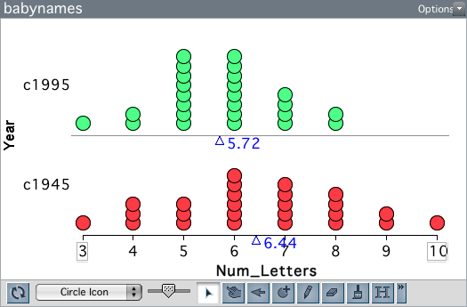

# Variación Muestral y el la Prueba de Bootstrap {-}

En la Unidad 3, descubrimos que, incluso bajo la hipótesis nula de ausencia de diferencias de grupo, las medias de grupo de los estudios aleatorizados varían debido a la variación experimental. Es decir, la variación en el resultado se produce debido a la asignación aleatoria. Recordemos que en la Unidad 2, la variación aleatoria fue una función del proceso de muestreo; diferentes muestras extraídas de la población (modelo) produjeron diferentes resultados. Cuando los resultados varían debido al proceso de muestreo, la variación aleatoria se denomina **variación muestral**.

### Variación Muestral {-}

Algunos diseños para la comparación de grupos también se ven afectados por la variación del muestreo. Por ejemplo, un diseño que emplea el muestreo aleatorio para obtener observaciones se vería inherentemente afectado por la variación del muestreo. Consideremos el siguiente estudio, que examina si los nombres de los bebés son cada vez más cortos con el paso del tiempo. 

> La Administración de la Seguridad Social (SSA) proporciona datos históricos sobre los nombres de todos los bebés nacidos en Estados Unidos. Los investigadores utilizaron la población de todos los nombres que figuraban al menos cinco veces en la base de datos de la SSA para tomar muestras aleatorias de 25 nombres de bebés nacidos en 1945 y 25 nombres de bebés nacidos en 1995. Se calculó la longitud (en letras) de cada nombre y se compararon las dos muestras. 

```{r echo=FALSE, eval=FALSE}
library(babynames)

set.seed(1915)

b1945 = babynames %>% 
  filter(year == 1945) %>% 
  sample_n(size = 25, replace = FALSE) %>% 
  mutate(num_letters = stringr::str_length(name))

set.seed(2001)
b1995 = babynames %>% 
  filter(year == 1995) %>% 
  sample_n(size = 25, replace = FALSE) %>% 
  mutate(num_letters = stringr::str_length(name))

allYears = rbind(b1945, b1995) %>%
  select(name, year, num_letters)

write.csv(allYears, row.names = FALSE, file = "~/Desktop/babynames.csv")
```


<br />

```{r out.width="50%", echo=FALSE, fig.align='center'}

```

<br />

El gráfico anterior muestra la distribución de la longitud de los nombres en las dos muestras. Los bebés nacidos en 1995 tienen nombres más cortos, en promedio, que los bebés nacidos en 1945. Esta diferencia de medias es de 0,72. ¿Es esta diferencia una prueba de que los nombres de los bebés son cada vez más cortos?

Para responder a esta pregunta, tenemos que saber cuánta variación esperamos en las diferencias de medias debido al azar. Aquí, el azar es una función del proceso de muestreo aleatorio; nótese que no hay asignación aleatoria a grupos (año) en estos datos. De forma similar a la prueba de aleatorización, necesitamos especificar un modelo de "no diferencia" y luego simular a partir de él. Pero, en la simulación, necesitamos modelar el muestreo aleatorio que se utilizó para generar los datos, no la asignación aleatoria a los grupos.

### Bootstrapping {-}

Si tuviéramos la población más grande de todos los nombres de bebés de 1945 y 1995, podríamos combinarlos todos y extraer dos muestras aleatorias de tamaño 25 de esta megapoblación; una muestra la etiquetamos como "1945" y la otra como "1995". (Combinamos las dos poblaciones porque el modelo hipotético de "sin diferencias" implica que en realidad sólo hay una población; ninguna diferencia entre las dos poblaciones). Podríamos hacer esto muchas veces, recogiendo cada vez la diferencia en las longitudes medias de los nombres entre las dos muestras. Trazando la diferencia de medias y calculando la desviación estándar de estas diferencias, podríamos cuantificar la cantidad de variación que esperamos sólo debido a la variación del muestreo.

Por desgracia, no disponemos de la población de nombres de bebés de 1945 y 1995. Lo que tenemos es una muestra aleatoria de esos nombres. Así que vamos a combinar los nombres de nuestras dos muestras para formar una "megapoblación". A continuación, vamos a extraer dos muestras aleatorias de tamaño 25 de esta "megapoblación". 

Un momento. Cuando combinamos nuestras dos muestras, nuestra "megapoblación" sólo tenía 50 nombres. Si extraemos dos muestras, cada una de tamaño 25, de esta "megapoblación", ¿no es toda la "megapoblación"? Si hacemos eso, ¿no es lo mismo que la prueba de aleatorización? ¿Cómo nos permite modelizar el error de muestreo? Después de todo, la prueba de aleatorización ayuda a modelar el error experimental.

Todo esto es cierto. Sin embargo, podemos modelar el error de muestreo con un giro. Cuando extraemos nuestros 25 nombres para cada muestra de nuestra "megapoblación", muestreamos CON REEMPLAZO. De este modo, imitamos la extracción de muestras aleatorias de una población mayor sin necesitar realmente dicha población. Se trata de un método realmente ingenioso llamado **bootstrapping** desarrollado por Brad Efron a finales de la década de 1970. El gran descubrimiento de Efron fue que mediante el bootstrapping (muestreo con sustitución) a partir de una muestra aleatoria, se podía obtener una buena estimación de la variación muestral. 
