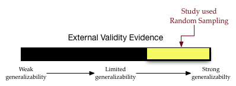

# Evidencia de Validez Eterna y Muestreo Aleatorio {-}

En la inferencia estadística, la generalización se refiere al proceso de utilizar datos de muestra para extraer conclusiones sobre la población más amplia de la que se extrajo la muestra. Los datos de la muestra proporcionan a las personas profesionales en estadística una estimación de la "verdad" exacta sobre la población. Por ejemplo, los datos recogidos de 1.000 estadounidenses sobre sus preferencias de voto pueden utilizarse para inferir las preferencias de voto de toda la población estadounidense. A las personas profesionales en estadística les suele interesar hacer inferencias sobre alguna medida resumen de la población, una media o un porcentaje de población. (*Vocabulario:* Las medidas de resumen de la población se denominan **parámetros**. Las estimaciones muestrales de los parámetros se denominan **estadísticos**).

¿Hasta qué punto es útil un estadístico muestral a la hora de estimar un parámetro poblacional? ¿Se pueden hacer inferencias razonables sobre una población a partir de los datos de una muestra? Esta pregunta es el núcleo de la ponderación de las pruebas sobre la validez externa. La validez externa es el grado en que las generalizaciones a una población más amplia son precisas y significativas.

Hay dos aspectos estadísticos que debemos tener en cuenta al evaluar las pruebas de validez externa: la variación muestral y el sesgo. La variación muestral es la idea de que las estadísticas de diferentes muestras varían. Por ejemplo, siguiendo con el ejemplo anterior, diferentes muestras de 1.000 estadounidenses producirían diferentes estimaciones de las preferencias de voto. Esta variación debe tenerse en cuenta a la hora de realizar las estimaciones. Una forma de pensar en la variación del muestreo es relacionarla con la calidad de la precisión. (Nos centraremos más en esto en la Unidad 5).  

La segunda característica estadística a la que debemos prestar atención es el sesgo. El sesgo estadístico se produce cuando los estadísticos de la muestra difieren sistemáticamente del parámetro de la población. La clave aquí es la palabra "sistemáticamente". Esto implica que hay algo en el proceso subyacente (aparte de la variación aleatoria) que afecta al proceso de estimación. 


### Sesgo Estadístico {-}

Para ayudarte a pensar en el sesgo, imagine que una persona, Arthur Dent, ha perdido sus llaves. La ubicación real de las llaves, la Biblioteca, es similar al parámetro de población. Arthur cree que ha perdido las llaves en el supermercado y busca en varios lugares alrededor del supermercado. Los lugares en los que Arthur busca son como las estadísticas muestrales. 

<br />

```{r bias-keys, out.width="70%", echo=FALSE, fig.align='left', fig.cap='This figure is a metaphor for statistical bias.', fig.align='center'}
knitr::include_graphics("img/bias-keys.png")
```

<br />

La figura \@ref(fig:bias-keys) es una metáfora del concepto de sesgo estadístico. Las ubicaciones de búsqueda de Arthur (estadísticas muestrales) están sistemáticamente en el lugar equivocado. Por término medio, el lugar en el que Arthur buscó (el centro del círculo amarillo) no es la ubicación real de las teclas. Compárelo con los lugares de búsqueda de la figura \ref(fig:unbiased-keys).

<br />

```{r unbiased-keys, out.width="70%", echo=FALSE, fig.align='left', fig.cap='This figure is a metaphor for unbiasedness.', fig.align='center'}
knitr::include_graphics("img/unbiased-keys.png")
```

<br />

La figura \@ref(fig:unbiased-keys) es una metáfora del insesgamiento. En promedio, donde Arthur buscó es la ubicación de las claves. Hay un par de conceptos más sobre los que esta metáfora puede ayudarnos a pensar.

1. Incluso en la figura \ref(fig:unbiased-keys), ninguna de las ubicaciones reales de búsqueda estaba justo en las llaves. Algunos estaban demasiado a la izquierda y otros demasiado a la derecha. Sin embargo, EN PROMEDIO, las posiciones de búsqueda "encontraron" las llaves. La forma en que definimos insesgado es que la MEDIA de las estadísticas está en el parámetro de población.

2. La media no tiene nada que ver con el tamaño del círculo amarillo. (El tamaño del círculo está relacionado con la cantidad de variación muestral, un concepto que trataremos en la Unidad 5). Las dos figuras siguientes también ilustran el insesgamiento (izquierda) y el sesgo (derecha), a pesar del tamaño del círculo amarillo.

<div style="float: left; margin-right: 5px;">


</div>

<div style="clear: both;">
3. El último concepto sobre el sesgo que hay que señalar es que el sesgo (o la falta de sesgo) es una propiedad del método de muestreo. La razón por la que los lugares de búsqueda no estaban en el lugar correcto es que el método utilizado por Arthur para elegir los lugares de búsqueda estaba sesgado. Pensó que había perdido las llaves en el supermercado, así que buscó allí. 
</div>

Un método de muestreo insesgado es el muestreo aleatorio o probabilístico. El muestreo aleatorio utiliza el azar para seleccionar las unidades de muestreo (participantes) de la población general. Cuando se ha empleado el muestreo aleatorio en un estudio, el insesgamiento del método de muestreo es una prueba contundente de validez externa; creemos mucho más en las generalizaciones a la población más amplia. En nuestro barómetro de validez estaríamos en el tercio superior (dependiendo de otros factores como el tamaño de la muestra).

<br />

```{r out.width="70%", echo=FALSE, fig.align='center'}

```

<br />

En este curso, analizaremos y utilizaremos el [muestreo aleatorio simple](https://en.wikipedia.org/wiki/Simple_random_sample). Para extraer una muestra aleatoria simple necesitamos una lista de TODOS los miembros de la población. Esta lista se denomina *marco de muestreo* o *marco muestral*. (Obtener un marco de muestreo puede ser muy difícil. Intente obtener una lista de todas las personas que viven en Estados Unidos). A continuación, empleamos el azar para extraer las unidades de muestreo, con la salvedad de que cada unidad del marco de muestreo tiene las mismas probabilidades de ser extraída. 
