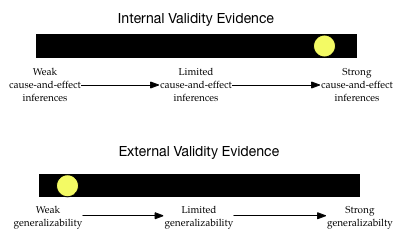

# Pruebas de validez e inferencias {-}

La manera en que se seleccionan los sujetos de la población general (muestreo) y el modo en que se asignan los sujetos seleccionados a las condiciones experimentales (diseño) desempeñan un papel importante en las inferencias que pueden extraerse. Estas dos facetas están directamente relacionadas con las cuestiones de [validez externa](https://www.socialresearchmethods.net/kb/external.php) y [validez interna](https://www.socialresearchmethods.net/kb/intval.php), respectivamente.

La validez es el grado en que las inferencias y conclusiones son significativas y precisas. Es importante que tenga en cuenta que la validación se refiere a las inferencias, no al estudio. (Por desgracia, es casi imposible saber si las inferencias que hacemos son válidas o no.) Por lo tanto, lo mejor que podemos hacer es aportar pruebas que respalden las afirmaciones de validez y presentar esas pruebas a la gente. En los estudios de investigación hay dos tipos principales de pruebas de validez que deben tenerse en cuenta:

- **Pruebas de validez interna:** Se trata de pruebas que respaldan la extracción de conclusiones de causa y efecto. Por lo general, este tipo de conclusiones sólo son apropiadas cuando un estudio ha empleado la asignación aleatoria. Más información en [https://www.socialresearchmethods.net/kb/intval.php](https://www.socialresearchmethods.net/kb/intval.php).

- **Pruebas de validez externa:** Se trata de pruebas que respaldan la extracción de conclusiones generalizables. Por lo general, este tipo de conclusiones sólo son apropiadas cuando un estudio ha empleado un muestreo aleatorio. Más información en [https://www.socialresearchmethods.net/kb/external.php](https://www.socialresearchmethods.net/kb/external.php).

Al igual que las pruebas utilizadas en un tribunal, resulta útil considerar las pruebas de validez en un continuo. Por ejemplo, después de leer sobre el muestreo y el diseño de un estudio concreto, puede imaginar los dos "barómetros" siguientes de las pruebas de validez interna y externa de las inferencias de un estudio:

<br />

```{r out.width="70%", echo=FALSE, fig.align='center'}

```

<br />

Las inferencias extraídas de este estudio pueden generalizar, pero probablemente no sean causales. A medida que leas los estudios de investigación (y trabajes en las actividades de clase) aprenderás a situar el punto amarillo a lo largo de estos dos continuos teniendo en cuenta los planes de muestreo y diseño utilizados en el estudio.

### Estudios sobre las alergias al cacahuete {-}

A continuación se presentan extractos del diseño de investigación de tres estudios diferentes sobre la alergia a los cacahuetes. Los investigadores que llevaron a cabo estos estudios utilizaron diseños de estudio diferentes. Después de leer los extractos de cada estudio, intente crear los dos barómetros para situar las pruebas de validez interna y externa. Esto nos ayudará a considerar las inferencias y conclusiones que pueden extraerse adecuadamente.

Recuerde que hay dos preguntas principales que debe plantearse al evaluar el diseño de un estudio: (1) ¿Cómo se seleccionaron los participantes del estudio entre la población? Esto nos ayuda a pensar en el grado de evidencia de la validez externa, y (2) ¿Cómo se asignaron las condiciones a las personas participantes del estudio seleccionados? Esto nos ayuda a situar las pruebas de validez interna.

### Diseño #1 {-}

Considere el diseño de la investigación de este estudio, publicado en el *New England Journal of Medicine*.^[Du Toit, G., et al. (2015). Ensayo aleatorizado de consumo de cacahuete en lactantes con riesgo de alergia al cacahuete. *New England Journal of Medicine, 372*(9), 803&ndash;813.]

<div class="excerpt">
**Ensayo aleatorizado del consumo de cacahuete en lactantes con riesgo de alergia al cacahuete**

Para estudiar si el consumo de cacahuete estaba relacionado con las alergias al cacahuete, las personas investigadoras inscribieron a 640 lactantes (de 4 a 11 meses de edad) con eczema grave, alergia al huevo, o ambos en el estudio LEAP. Todas las personas participantes se inscribieron en un único centro de salud del Reino Unido.

Se estratificó a las personas participantes en dos cohortes de estudio (en función de los resultados de una prueba cutánea de alergia al cacahuete) y, a continuación, se asignó aleatoriamente a las personas participantes de cada cohorte de estudio a un grupo en el que se consumiría cacahuete dietético, o a un grupo en el que se evitaría su consumo. El resultado primario fue la proporción de participantes con alergia al cacahuete a los 60 meses de edad.

Entre las 530 personas lactantes de una cohorte, la prevalencia de alergia al cacahuete a los 60 meses fue del 13,7% en el grupo de evitación y del 1,9% en el grupo de consumo. La diferencia absoluta en el riesgo del 11,8% representa una reducción relativa del 86,1% en la prevalencia de la alergia al cacahuete. En la otra cohorte (98 lactantes), la prevalencia de alergia al cacahuete fue del 35,3% en el grupo de evitación y del 10,6% en el grupo de consumo.

Estos hallazgos sugieren que las personas participantes de alto riesgo que consumieron productos de maní desde la infancia hasta los 5 años tienen menos probabilidades de desarrollar una alergia al maní que aquellas que evitaron los cacahuetes, según el ensayo aleatorizado LEAP.
</div>
 

Cuando lea sobre el diseño de un estudio, intente identificar inicialmente


- La población a la que las personas investigadoras desean generalizar sus resultados. 
- La muestra utilizada en el estudio Y cómo se muestrearon a las personas participantes.
- Los grupos de control/tratamiento Y cómo se asignaron las personas participantes a estos grupos.
- La variable de respuesta/resultado Y cómo se midió esta variable.
- Resultados y pruebas estadísticas


Basándose en el extracto sobre el diseño de este estudio, intente identificar

La población a la que la persona investigadora desea generalizar los resultados engloba a las personas de alto riesgo que consumen productos derivados del cacahuete. Estas personas NO fueron seleccionadas al azar. Aunque el extracto no lo dice, es probable que sus padres se ofrecieran voluntariamente a participar en el estudio.
- El estudio empleó un diseño de cohortes (un estudio de replicación) en el que las personas de cada cohorte fueron asignados aleatoriamente al tratamiento (consumir una barrita que contenía proteína de cacahuete) o al control (evitar los cacahuetes). La primera cohorte incluyó 540 lactantes y la cohorte de replicación incluyó 98 lactantes.
- La respuesta/resultado que se midió fue la prevalencia de la alergia al cacahuete tras 60 meses de tratamiento. En otras palabras, era el porcentaje del grupo de tratamiento (o control) que tenía alergia al cacahuete al cabo de 5 años.
- En la primera cohorte, el grupo de tratamiento presentó un porcentaje MENOR de lactantes que desarrollaron alergia al cacahuete que el grupo de control (1,9% frente a 13,7%). Este hallazgo se repitió en la cohorte de replicación, que descubrió que sólo el 10,6% del grupo de tratamiento tenía alergia al cacahuete después de 60 meses, frente al 35,3% del grupo de control. No se proporcionan valores *p* ni otras pruebas inferenciales.

Teniendo en cuenta esta información, ¿cómo serían sus barómetros de pruebas de validez? 

<br />

```{r out.width="70%", echo=FALSE, fig.align='center'}

```

<br />

El nivel de evidencia de validez interna es bastante alto. El estudio utilizó la asignación aleatoria para colocar a las personas lactantes en los grupos de control y tratamiento. Además, reprodujo este diseño utilizando un estudio de cohortes. Por último, el tamaño de las muestras era bastante grande, por lo que la asignación aleatoria probablemente funcionó bastante bien para que los grupos fueran estadísticamente idénticos. Basándose en todo esto, las personas investigadoras tienen una afirmación bastante buena de causa-efecto acerca de que el consumo de cacahuetes reduce la prevalencia de las alergias al cacahuete.

Sin embargo, el grado de evidencia de validez externa es bastante bajo. No se tomaron muestras aleatorias de la población de lactantes de alto riesgo. Constituyen una [muestra de conveniencia](http://research-methodology.net/sampling-in-primary-data-collection/convenience-sampling/). Esto hace probable que la muestra no represente a la población en todas sus características. Por ejemplo, para participar voluntariamente en el estudio, los bebés podrían haber sido identificados como de alto riesgo en el mismo centro médico. Esto podría significar que sus padres tienen un nivel socioeconómico similar, o viven en barrios similares, etc., lo que podría no representar a la población en general. Esto limita seriamente la generalizabilidad de estos resultados a la población más amplia de lactantes de alto riesgo.


### Diseño #2 {-}

Considere el diseño de investigación de este estudio, publicado en el *Journal of Allergy and Clinical Immunology*.^[Sicherer, S. H., Wood, R. A., Stablein, D., Lindblad, R., Burks, A. W., Liu, A. H., Jones, S. M., Fleischer, D. M., Leung, D. Y., &amp; Sampson, H. A. (2010). Maternal consumption of peanut during pregnancy is associated with peanut sensitization in atopic infants. *Journal of Allergy and Clinical Immunology, 126*(6), 1191&ndash;1197.]


<div class="excerpt">
**El consumo de cacahuete por parte de la madre durante el embarazo se asocia con la sensibilización al cacahuete en lactantes atópicos**.

Para identificar los factores asociados a la sensibilización al cacahuete, evaluamos a 503 lactantes de entre 3 y 15 meses de edad con probable alergia a la leche o al huevo pero sin diagnóstico previo de alergia al cacahuete. Las personas lactantes se inscribieron en el estudio en cinco centros: Mount Sinai School of Medicine, Nueva York; Duke University Medical Center, Durham, Carolina del Norte; Johns Hopkins University School of Medicine, Baltimore, Maryland; National Jewish Health, Denver, Colorado, y Arkansas Children's Hospital, Little Rock, Arkansas. 

Se preguntó a las madres de las personas lactantes sobre la frecuencia con que consumían cacahuetes durante cada trimestre del embarazo y durante la lactancia. La investigación descubrió que el consumo frecuente de cacahuete durante el embarazo estaba fuertemente asociado con la sensibilización/alergia al cacahuete (*p < .001*). También se realizaron análisis en los que se controlaron el sexo y la raza de los lactantes, dos factores que se cree que están relacionados con las alergias al cacahuete.  Los análisis indicaron que, incluso después de controlar estos factores, la frecuencia de consumo de cacahuetes durante el embarazo se asociaba fuerte y positivamente con la sensibilización/alergia a los cacahuetes (*p < 0,001*).
</div>

 
Basándose en el extracto sobre el diseño de este estudio, intente identificar


- La población a la que las personas investigadoras desean generalizar sus resultados. 
- La muestra utilizada en el estudio Y cómo se tomaron las muestras de las personas participantes.
- Los grupos de control/tratamiento Y cómo se asignaron los participantes a estos grupos.
- La variable de respuesta/resultado Y cómo se midió esta variable.
- Resultados y evidencia estadística. (Sugerencia: se informa de varias comparaciones).

<div class="msg_list">
<button class="msg_head">Click Here to<br />Show/Hide Responses.</button>

<div class="msg_body">
- La población a la que las personas investigadoras desean generalizar sus resultados es la de todos los lactantes atópicos.
- La muestra incluyó 503 lactantes atópicos (de 3 a 15 meses) sin alergias previas al cacahuete que se inscribieron en uno de los cinco centros. Aunque el extracto no lo dice, es probable que sus padres se ofrecieran voluntariamente a participar en el estudio.
- El estudio fue de carácter observacional; los investigadores NO obligaron a las madres a comer una determinada cantidad de cacahuetes durante el embarazo. (Encontrará más información sobre los estudios observacionales en *Estudios observacionales y la prueba de Bootstrap*).
- La respuesta/resultado que se mide en cada comparación es si el lactante presentó o no sensibilización/alergia al cacahuete.
- Los investigadores hallaron pruebas estadísticas de una asociación entre el consumo materno de cacahuetes durante el embarazo y las alergias a los cacahuetes en los lactantes. Esta asociación no era muy compatible con la hipótesis de ausencia de asociación entre la frecuencia de consumo de cacahuetes y las alergias al cacahuete (*p < .001*). Este resultado también se observó después de tener en cuenta las diferencias raciales y de género. 
</div>

</div>

Teniendo en cuenta esta información, ¿cómo serían sus barómetros de pruebas de validez? 

<div class="msg_list">
<button class="msg_head">Click Here to<br />Show/Hide Barometers.</button>

<div class="msg_body">

```{r out.width="70%", echo=FALSE, fig.align='center'}
knitr::include_graphics("img/validity-evidence-peanut-02.png")
```

<br />

El nivel de evidencia de validez interna es bajo. El estudio no utilizó la asignación aleatoria para asignar la frecuencia de consumo de cacahuetes de las madres durante el embarazo. Las personas investigadoras mejoraron el nivel de sus pruebas de validez interna controlando el sexo y la raza del bebé. Aunque se trata de una prueba de causa-efecto más sólida que no controlar nada, sigue habiendo muchos factores alternativos (aparte de la frecuencia de ingestión de cacahuetes por parte de la madre) que podrían explicar las diferencias en las alergias a los cacahuetes de los lactantes.

El grado de evidencia de validez externa también es bastante bajo. No se tomaron muestras aleatorias de la población de lactantes atópicos. Ni siquiera fueron muestreados aleatoriamente de los cinco centros. Constituyen una [muestra de conveniencia](http://research-methodology.net/sampling-in-primary-data-collection/convenience-sampling/). Esto hace probable que la muestra no represente a la población. (Es probable que esté sistemáticamente sesgada.) Esto limita gravemente la generalizabilidad de estos resultados a la población más amplia de lactantes atópicos.
</div>

</div>


### Diseño #3 {-}

Por último, considere el diseño de la investigación de este estudio, publicado en el *Journal of Allergy and Clinical Immunology*.^[Sicherer, S. H., Mu&ntilde;oz-Furlong, A., &amp; Sampson, H. A. (2003). Prevalence of peanut and tree nut allergy in the United States determined by means of a random digit dial telephone survey: A 5-year follow-up study. *Journal of Allergy and Clinical Immunology, 112*(6), 1203&ndash;1207.]

<div class="excerpt">
**Prevalencia de la alergia a los cacahuetes y los frutos secos en Estados Unidos determinada mediante una encuesta telefónica de marcación aleatoria: Un estudio de seguimiento de 5 años**

Para estudiar si la prevalencia de la alergia a los cacahuetes entre la población general de Estados Unidos ha cambiado con el tiempo, las personas investigadoras contactaron telefónicamente con 9.252 hogares en 2002 para realizar una encuesta sobre la alergia a los cacahuetes. (Estos números de teléfono constituían una muestra aleatoria de números de teléfono y excluían los números no residenciales. Se llamó a los hogares a diferentes horas del día y en diferentes días para optimizar el contacto con un residente. Se realizaron al menos 10 intentos de contactar con un residente de cada hogar).

De los hogares contactados, 4.855 aceptaron participar. Estos hogares representaban una muestra de 13.493 personas Los resultados de esta encuesta se compararon con los de una encuesta comparable realizada en 1997. Estas comparaciones indicaron que la tasa de alergia a los cacahuetes entre las personas adultas notificada en 1997 (0,4%) no era estadísticamente diferente de la notificada en 2002 (0,8%). En las niñas y niños, las personas investigadoras encontraron una diferencia entre las tasas notificadas en 1997 (0,6%) y las de 2002 (1,2%; *p = 0,05*). Se concluyó que la tasa de alergia al cacahuete entre las niñas y niños se ha duplicado de 1997 a 2002.
</div>
 

Basándose en el extracto sobre el diseño de este estudio, intente identificar

- La población a la que las personas investigadoras desean generalizar sus resultados. 
- La muestra utilizada en el estudio Y cómo se tomaron las muestras de las personas participantes.
- Los grupos de control/tratamiento Y cómo se asignaron las personas participantes a estos grupos.
- La variable de respuesta/resultado Y cómo se midió esta variable.
- Resultados y pruebas estadísticas. (Sugerencia: se informa de varias comparaciones).


<div class="msg_list">
<button class="msg_head">Click Here to<br />Show/Hide Responses.</button>

<div class="msg_body">
- La población a la que las personas investigadoras quieren generalizar sus resultados son todos los hogares de Estados Unidos.
- La muestra incluyó 4855 hogares.
- El estudio fue de carácter observacional; las personas investigadoras NO asignaron hogares alérgicos a los cacahuetes.
- La respuesta/resultado que se mide en cada comparación es el número de adultos y niños de la familia con alergia a los cacahuetes.
- Las personas investigadoras encontraron pruebas estadísticas de una diferencia en las tasas de alergia a los cacahuetes en las niñas y  niños entre 1997 y 2002. Esta diferencia no era muy compatible con el modelo hipotetizado de ausencia de diferencias entre las tasas de 1997 y 2002 (*p = .05*).  
</div>

</div>

Teniendo en cuenta esta información, ¿cómo serían sus barómetros de pruebas de validez? 

<div class="msg_list">
<button class="msg_head">Click Here to<br />Show/Hide Barometers.</button>

<div class="msg_body">

```{r out.width="70%", echo=FALSE, fig.align='center'}
knitr::include_graphics("img/validity-evidence-peanut-03.png")
```

<br />

El nivel de pruebas de validez interna es bajo. Dado que las personas investigadoras no intentan atribuir una razón causal a ninguna diferencia en las alergias a los cacahuetes, esto no es muy preocupante.

El grado de evidencia de validez externa también es bastante bajo. Aunque los números de teléfono se seleccionaron inicialmente al azar, muchos hogares no respondieron. Esto echa por tierra la aleatoriedad. Además, muchas personas en EE.UU. no tienen teléfono o están en una lista de personas a las que no se puede llamar. Esto limita mucho las generalizaciones.
</div>

</div>
