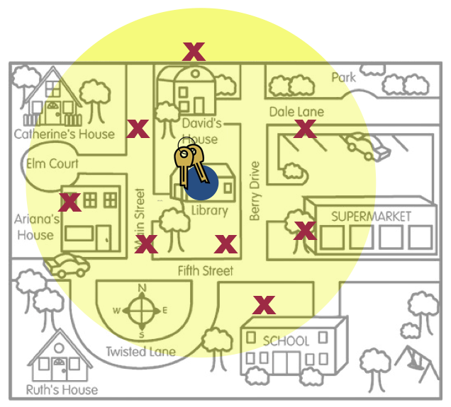

# Estimando la Incertidumbre {-}

> Mucho mejor una respuesta aproximada a la pregunta correcta &hellip; que una respuesta exacta a la pregunta equivocada.^[Tukey, J. (1962). The future of data analysis. *Annals of Mathematical Statistics 33*(1), 1&ndash;67.]

Aparte del contraste de hipótesis, uno de los usos más comunes de la inferencia estadística es la estimación de parámetros desconocidos utilizando datos de muestra. Las encuestas son una de las aplicaciones en las que se utiliza la estimación estadística. Por ejemplo, [Gallup](http://www.gallup.com/) y el [Pew Research Center](http://www.pewresearch.org/) son organizaciones que utilizan la estimación estadística para ofrecer resultados de las actitudes y opiniones del público sobre temas que van desde la política y la economía hasta la concienciación social y la salud y el bienestar. Los resultados de sus encuestas aparecen a diario en casi todos los periódicos, blogs de noticias y sitios web del mundo.

La estimación estadística no sólo la utilizan las personas encuestadoras. Profesionales en biología, ciencias sociales y medicina utilizan la estimación estadística para cuantificar las características de la población. Por ejemplo, el Departamento de Recursos Naturales de Minnesota calcula cada año las poblaciones de varias especies de animales, aves y peces. Estas estimaciones se utilizan para ayudar a establecer normativas de caza y pesca, así como para asignar recursos.^[Aquí está el [Informe sobre la población de lobos en 2016](http://files.dnr.state.mn.us/wildlife/wolves/2016/survey-wolf.pdf).]


### Cuantificando la Incertidumbre: Intervalos de compatibilidad {-}

Cuando profesionales en estadística reportan estimaciones muestrales, suelen proporcionar el valor de la estimación junto con la cuantificación de la incertidumbre en esta estimación. Esta medida de la incertidumbre nos da una indicación de la "precisión" de la estimación. Por ejemplo, consideremos de nuevo el ejemplo de la persona que perdió sus llaves. En esas imágenes, recuerde, los lugares donde buscó las llaves (las x rojas) representan los datos de la muestra. 

<br />

```{r uncertainty-keys, out.width="70%", echo=FALSE, fig.align='center', fig.cap='This figure is a metaphor for statistical uncertainty.', fig.align='center'}

```

<br />

Una estimación que puede hacerse a partir de esos datos es la ubicación "media"^[En el espacio bidimensional, como en un mapa, la "media" se denomina [centroide](https://en.wikipedia.org/wiki/Centroid).]. Esta ubicación está marcada con un gran punto azul. Esta estimación es la mejor suposición sobre dónde se encuentran las claves reales (el parámetro de población). El área amarilla representa la incertidumbre, es decir, otros lugares en los que podrían estar las llaves, aparte de la mejor estimación en una localización. La interpretación de esta incertidumbre le da un rango de ubicaciones donde podrían estar las llaves reales: el intervalo de compatibilidad. 

### Cuantificando la Incertidumbre: Margen de error {-}

Los intervalos de compatibilidad se comunican a menudo utilizando la estimación de la muestra (estadística) y un margen de error. Por ejemplo, considere los siguientes resultados de encuestas publicados en el [New York Times el 30 de junio de 2011](http://query.nytimes.com/gst/fullpage.html?res=980DE0DF1530F933A05755C0A9679D8B63):

> A medida que el mercado de la vivienda se desplomaba en los últimos años con una rapidez y una magnitud que no se veían desde la Gran Depresión, los aspectos de la propiedad de la vivienda se han debatido como nunca antes. Hay preguntas difíciles sobre el papel que debe desempeñar el gobierno... incluida la cuantía del pago inicial que deben exigir las personas prestamistas. La necesidad de que las personas compradoras aporten un pago inicial del 20% -la norma durante décadas, pero fuera del alcance de muchas familias en la actualidad- es objeto de un acalorado debate. El 58% de las personas encuestadas opina que las personas prestamistas deberían exigirlo, mientras que el 36% dice que no. La encuesta telefónica nacional se realizó el 24 y 28 de junio a 979 personas adultas y tiene un margen de error de muestreo de más o menos tres puntos porcentuales para todas las personas adultos.

En este artículo, el porcentaje de personas adultas en Estados Unidos que creen que las personas prestamistas deberían exigir un pago inicial del 20% para la compra de una vivienda es el siguiente:

- **Estimación Muestral:** 58%
- **Margen de Error:** 3%

Aunque el intervalo de compatibilidad no se indica directamente, puede calcularse utilizando la estimación muestral y el margen de error como,

$$
\mathrm{Estimación~Muestral} \pm \mathrm{Margen~de~Error}
$$

En este ejemplo,

$$
58\% \pm 3\% = \left[55\%,~61\%\right]
$$

Los estadísticos lo denominan **intervalo de compatibilidad** porque proporciona un intervalo de valores plausibles para el porcentaje de todas las personas adultas de Estados Unidos que creen que las personas prestamistas deberían exigir un pago inicial del 20% por una vivienda que son compatibles con los datos observados. A partir de los datos observados, la mejor estimación de la "verdad" (el parámetro poblacional) es que el 58% de todos las personas adultas de Estados Unidos creen que las personas prestamistas deberían exigir un pago inicial del 20% por una vivienda. Sin embargo, debido a la incertidumbre asociada al muestreo aleatorio, puede ser que entre el 55% y el 61% de todas las personas adultas de Estados Unidos crean que las personas prestamistas deberían exigir un pago inicial del 20% por una vivienda. 

En la interpretación anterior, asociábamos la cantidad de incertidumbre con la variación debida al muestreo aleatorio. Resulta que el margen de error está directamente relacionado con la cuantificación del error de muestreo. De hecho,  

$$
\mathrm{Margen~de~Error} = 2 \times \mathrm{Error~Estándar}
$$

Aunque las personas profesionales en estadística tienden a utilizar dos errores estándar para calcular la estimación de la incertidumbre, se trata de una elección un tanto arbitraria. Algunas personas investigadoras eligen uno o tres errores estándar.


### ¿Qué es el Error Estándar? {-}

El error estándar es sólo un nombre elegante para la desviación estándar cuando la distribución se compone de estadísticas (por ejemplo, promedios, porcentajes). En otras palabras, la desviación estándar de un conjunto de resultados simulados. Esto significa que, en la práctica, podemos utilizar el bootstrap para modelizar la variación del muestreo, obtener la desviación típica de los resultados bootstrap y utilizarla junto con la estimación de los datos observados para obtener un intervalo de compatibilidad.

Al interpretar los intervalos de compatibilidad, hay que tener en cuenta un par de cosas.

- El intervalo de compatibilidad se utiliza para estimar el parámetro de una población.
- El intervalo de compatibilidad da un rango de valores compatibles para el parámetro de población. 
- Cada valor del intervalo no es igualmente compatible con los datos (los valores en el centro del intervalo son más compatibles con los datos que los valores en los extremos del intervalo). Además, los valores fuera del intervalo no son incompatibles con los datos; sólo son mucho, mucho menos compatibles.

Para ayudarte a comprender mejor las ideas relacionadas con el error típico y el margen de error, te recomendamos leer el capítulo 10 (*¿Qué es un margen de error?*) de un breve folleto elaborado por la Sección de Investigación de Encuestas de la Asociación Americana de Estadística. 

- Disponible en [http://www.prm.nau.edu/prm447/asa%20brochures/margin.pdf](http://www.prm.nau.edu/prm447/asa%20brochures/margin.pdf).

