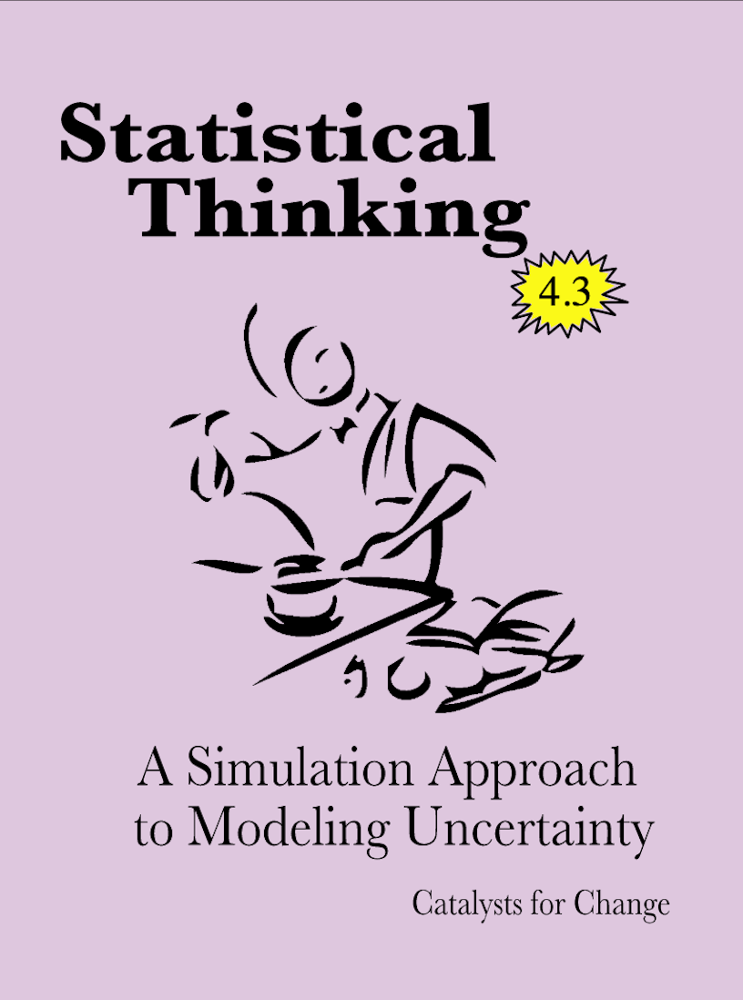

#  Materia Frontal {-}


```{r out.width="25%", echo=FALSE, fig.align='center'}

```

<br />

Este sitio es una versión en español basada en la versión más actual del *Statistical Thinking: A Simulation Approach to Modeling Uncertainty* del Proyecto CATALST, utilizado por la Universidad de Minnesota en el curso EPSY 3264 - Estadística Básica y Aplicada. Aquí podrá acceder a las lecturas del curso en español, así como a la versión original en inglés de los conjuntos de datos y el manual de laboratorio. El sitio web también incluye enlaces y recursos útiles para cada uno de los temas del curso.


### Licencias y atribución {-}

Derechos de autor &copiar; 2021 Catalizadores para el cambio

PUBLICADO POR CATALYST PRESS

<a rel="licencia" href="http://creativecommons.org/licenses/by/4.0/"></a>

Este trabajo está autorizado bajo una <a rel="license" href="http://creativecommons.org/licenses/by/4.0/">licencia internacional Creative Commons Attribution 4.0</a>. Usted es libre de compartir, remezclar y hacer uso comercial del trabajo con la condición de que proporcione la atribución adecuada. Para hacer referencia a este trabajo, utilice:

- Zieffler, A., & Catalysts for Change. (2021). *Statistical Thinking: A simulation approach to uncertainty* (4.3th ed., V.N.V. Rao & P. Vivas Corrales, Trans.). Minneapolis, MN: Catalyst Press. [http://RaoVNV.github.io/pensamiento-estadistico/](http://RaoVNV.github.io/pensamiento-estadistico/)

El trabajo para crear el material que aparece en el libro fue posible gracias a la National Science Foundation (DUE–0814433).

El material de este sitio web y del manual de laboratorio es un reflejo directo de las ideas, el trabajo y el esfuerzo de varios Catalysts for Change. Incluyen (alfabéticamente): Ethan Brown, Jonathan Brown, Dan Butler, Tony Casci, Beth Chance, George Cobb, Robert delMas, Katherine Edwards, Michelle Everson, Jeffrey Finholm, Chris Fiscus, Elizabeth Fry, Joan Garfield, Theresa Gieschen, Meg Goerdt , Robert Gould, Adam Gust, Melissa Hanson, John Holcomb, Michael Huberty, Rebekah Isaak, Kari Johnson, Nicola Justice, Laura Le, Chelsey Legacy, Regina Lisinker, Suzanne Loch, Matthew Mullenbach, Michael Nguyen, Amy Okan, Vimal Rao, Allan Rossman, Anelise Sabbag, Pablo Vivas Corrales, Andrew Zieffler, and Laura Ziegler


<br />


### Colofón {-}

Hay dos [Google Fonts](https://fonts.google.com/) que se utilizan en el sitio web. Los encabezados usan [Playfair Display](https://fonts.google.com/specimen/Playfair+Display) y el texto de visualización es [Alegreya](https://fonts.google.com/specimen/Alegreya).

Los iconos utilizados en el sitio web son:

- [Clave](https://thenounproject.com/iconproducer/collection/keys/?oq=key&cidx=0&i=713748) por Iconic de [Noun Project](https://thenounproject.com/)


